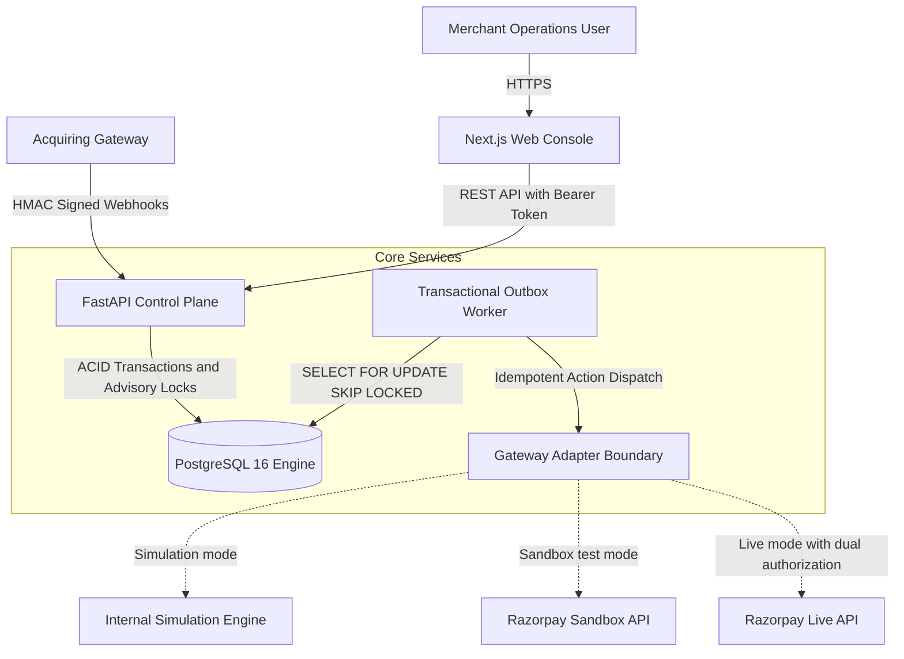
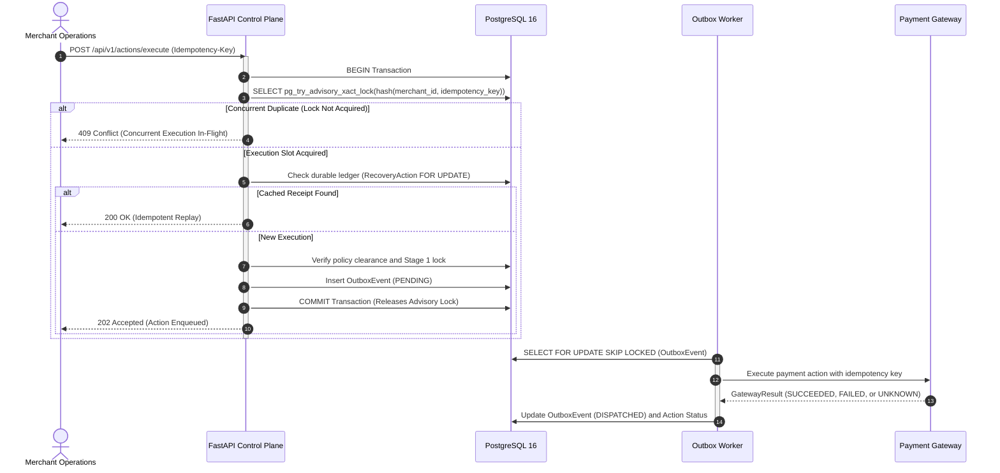

# RAY — Merchant Revenue Recovery Control Plane

Deterministic execution engine, transactional outbox, and financial invariant enforcement for payment retry and remediation workflows.

[](https://github.com/AYUSH676-JARVIS/RAY/actions/workflows/ci.yml)
[](tests/)
[](tests/invariants/)
[](tests/concurrency/)
[](apps/web/e2e/)
[](docs/security.md)
[](requirements.txt)
[](apps/web/)
[](#license)

---

## What RAY Does

RAY is an open-source payment recovery control plane designed to automate retry and remediation workflows for failed online transactions while enforcing deterministic financial safety boundaries.

* **Decoupled Intelligence**: Machine learning and heuristic scorers generate advisory recovery recommendations without write access to financial databases or payment gateway credentials.
* **Deterministic Policy Gates**: Authorizations are strictly governed by programmatic rules (retry limits, cooldown windows, velocity caps, tenant boundaries).
* **Distributed Idempotency**: PostgreSQL transaction-scoped advisory locks serialize concurrent execution attempts across API pods and workers.
* **Transactional Outbox**: State transitions and recovery dispatches commit within the same ACID database transaction, preventing dual-write inconsistencies.
* **Ambiguity Preservation**: Network timeouts and indeterminate gateway responses enter an `UNKNOWN` state that blocks blind retries until authoritative reconciliation completes.
* **Tamper-Evident Audit Logging**: Every state transition is recorded in an append-only, SHA-256 hash-chained audit log for end-to-end verifiability.

---

## Why This Problem Exists

In card-not-present (CNP) e-commerce and merchant billing, transactions frequently fail due to transient infrastructure conditions rather than permanent account closures. Common transient causes include issuing bank network timeouts, 3D Secure (3DS) authentication drops, acquirer throttling, and temporary insufficient funds.

Naive recovery implementations introduce severe financial and operational risks:

1. **The Read Timeout Ambiguity Trap**: When an HTTP POST to an acquirer times out after 10 seconds, the client cannot determine whether the charge was debited, queued, or discarded. If a recovery system assumes failure and blindly retries, the customer is double-charged.
2. **Card Network Scheme Fines**: Card networks penalize excessive retries on permanent declines (e.g., Visa Category 1 fraud rules restrict retries to zero; Categories 2 and 3 restrict retries to 15 attempts over 30 days). Uncontrolled retries trigger scheme fines and elevate merchant chargeback ratios.
3. **Split-Brain Distributed Locks**: Disjoint lock stores (e.g., Redis-based locks with time-to-live expiration) can expire prematurely under worker garbage collection pauses or network partitions, allowing concurrent worker processes to debit the same transaction twice.
4. **Unconstrained Direct AI Execution**: Granting large language models or autonomous agents direct authority to trigger payment APIs creates vulnerabilities to prompt injection, hallucinated parameters, and unconstrained financial liability.

RAY addresses these failure modes by enforcing deterministic state transitions, database-level locking, and strict isolation between recommendation logic and execution authority.

---

## Core Design Principle: Advisory Separation from Execution

A foundational architectural invariant of RAY is that **probabilistic advisory intelligence never directly executes financial actions**.

```
    Advisory Intelligence (ML / Heuristic Scoring)
                         │
                         ▼
             Deterministic Policy Engine
                         │
                         ▼
             Deterministic Action Layer
                         │
                         ▼
              Payment Gateway Adapter
                         │
                         ▼
         Authoritative Outcome Verification
                         │
                         ▼
           Immutable Chained Audit Record
```

* **Advisory Models** evaluate payment telemetry, failure codes, and customer risk profiles to output structured candidate recommendations. They possess **read-only database context, zero database mutation rights, and zero payment gateway credentials**.
* **Deterministic Policy Engine** evaluates non-negotiable business rules (merchant retry ceilings, velocity throttles, customer risk limits, and tenant boundaries). If policy criteria are unmet, the recovery action is rejected before touching the network.
* **Action Execution Layer** coordinates execution through PostgreSQL advisory locks and durable ledgers, ensuring exact-once dispatch semantics.
* **Authoritative Verification** confirms real-world monetary status via cryptographic webhook processing and status inquiry reconciliation.
* **Audit Logger** persists an immutable, cryptographically chained receipt of the decision lifecycle.

---

## Architecture



### Component Boundaries

* **Merchant Web Console (`apps/web/`)**: Next.js 16 (React 19, TypeScript) operational interface providing decision visibility, payment timeline inspection, manual action reviews, audit chain verification, and system administration.
* **Control Plane API (`apps/api/`)**: FastAPI REST API providing multi-tenant isolation, role-based access control (RBAC), idempotency evaluation, opportunity detection, decision workflows, and cryptographic webhook ingestion.
* **Relational Storage & State Engine (`services/money_graph/`)**: PostgreSQL 16 enforcing relational integrity across 12 domain entities (`merchants`, `customers`, `orders`, `payments`, `payment_attempts`, `payment_failures`, `recovery_opportunities`, `policy_decisions`, `recovery_actions`, `webhook_deliveries`, `audit_events`, `task_queue`).
* **Background Worker Daemon (`apps/worker/`)**: Polling-based background daemon executing the transactional outbox processor, scheduled retry actions, and ambiguous payment reconciliations.
* **Gateway Adapter Boundary (`services/action_layer/gateway.py`)**: Abstracted payment gateway interface normalizing gateway interactions into standardized `GatewayResult` objects across simulation, sandbox, and live execution modes.

---

## Financial Safety Invariants

Every financial invariant in RAY is enforced at the code and database levels and backed by automated tests.

### 1. `UNKNOWN ≠ FAILED` (Ambiguity Preservation)
* **WHAT**: Ambiguous gateway outcomes (network connection timeouts, socket resets, HTTP 504 responses) transition the transaction to `PaymentStatus.UNKNOWN`.
* **WHY**: Network timeouts indicate a lost response, not a failed charge. If the gateway debited the customer before dropping the connection, retrying immediately causes duplicate billing.
* **HOW**: `ActionExecutor` checks payment status before executing any action. If status is `UNKNOWN`, it raises `AmbiguousOutcomeBlockedError`. Direct retries are blocked until authoritative reconciliation resolves the true state.
* **VERIFIED BY**: [test_financial_execution_invariants.py](tests/invariants/test_financial_execution_invariants.py) (`test_invariant_6_unknown_no_blind_retry`), [test_financial_execution_failures.py](tests/failure/test_financial_execution_failures.py).

### 2. Transaction-Scoped Distributed Idempotency
* **WHAT**: Concurrent or sequential duplicate requests with the same idempotency key result in exactly one payment gateway invocation.
* **WHY**: Eliminates duplicate charges caused by rapid user retries, distributed client replays, or duplicate webhook notifications.
* **HOW**: In PostgreSQL, `IdempotencyManager` computes a deterministic 32-bit integer hash of `(merchant_id, idempotency_key)` and executes `SELECT pg_try_advisory_xact_lock(:key)`. If the lock is held by a concurrent transaction, it immediately raises `ConcurrentExecutionBlockedError` (HTTP 409 Conflict). For completed actions, durable receipts in `RecoveryAction` are queried with `FOR UPDATE`, allowing cached replay even after complete process restarts.
* **VERIFIED BY**: [test_100_thread_adversarial.py](tests/concurrency/test_100_thread_adversarial.py), [test_distributed_idempotency_postgres.py](tests/concurrency/test_distributed_idempotency_postgres.py).

### 3. Transactional Outbox Pattern
* **WHAT**: Business entity state mutations and outbound recovery events are committed in the exact same ACID database transaction.
* **WHY**: Prevents distributed dual-write inconsistencies where a database transaction commits but the outbound network call fails or drops during a crash.
* **HOW**: When an action is authorized, an `OutboxEvent` record is written to PostgreSQL within the primary transaction. The `OutboxProcessor` worker drains pending records using `SELECT ... FOR UPDATE SKIP LOCKED` and transitions records to `DISPATCHED` upon verified delivery.
* **VERIFIED BY**: [test_transactional_outbox.py](tests/concurrency/test_transactional_outbox.py), [test_transaction_integrity.py](tests/unit/test_transaction_integrity.py).

### 4. Zero-Float Financial Precision
* **WHAT**: All financial amounts are calculated and stored using exact numeric decimal types, completely prohibiting IEEE 754 binary floating-point numbers.
* **WHY**: Binary floats suffer from representation roundoff errors (e.g., `0.1 + 0.2 = 0.30000000000000004`), causing fractional cent drift and ledger reconciliation discrepancies.
* **HOW**: Stored in PostgreSQL as `NUMERIC(18, 4)`. Handled in Python exclusively as `decimal.Decimal` with explicit `ROUND_HALF_UP` quantization. Negative amounts are rejected by validation schemas.
* **VERIFIED BY**: [test_financial_decimal_audit.py](tests/invariants/test_financial_decimal_audit.py).

### 5. Distributed Fail-Closed Kill Switch
* **WHAT**: Global emergency kill switch that halts all recovery executions across all cluster instances within a single database transaction.
* **WHY**: Provides immediate operational circuit-breaking during upstream gateway degradation, processor outages, or identified anomalies.
* **HOW**: Authoritative state is stored in PostgreSQL (`system_settings.kill_switch_engaged`). The execution layer checks this flag prior to any dispatch. If engaged, or if the database is unreachable, the engine immediately fails closed (`FinancialExecutionBlockedError`).
* **VERIFIED BY**: [test_distributed_kill_switch.py](tests/concurrency/test_distributed_kill_switch.py).

### 6. Dual-Key Live Execution Boundary
* **WHAT**: Live monetary transaction execution against production card networks is disabled by default and requires two separate authorization controls.
* **WHY**: Prevents accidental live debits during staging, testing, or developer onboarding.
* **HOW**: Execution requires both `LIVE_EXECUTION_ENABLED=true` and `STAGE_1_SAFETY_LOCK=false`. If live execution is attempted with default placeholder keys or without Stage 2 administrative approval, `ActionExecutor` raises `FinancialExecutionBlockedError` and records `ActionExecutionStatus.BLOCKED_STAGE1_SAFETY`.
* **VERIFIED BY**: [test_razorpay_live_gateway.py](tests/unit/test_razorpay_live_gateway.py), [test_stage2_money_movement.py](tests/unit/test_stage2_money_movement.py).

### 7. Cryptographic Tamper-Evident Audit Chaining
* **WHAT**: Every audit event is cryptographically linked to its predecessor using SHA-256 parent hash chaining.
* **WHY**: Ensures non-repudiation and immediate detection of unauthorized record insertion, modification, or deletion.
* **HOW**: Each `AuditEvent` computes:
  `event_hash = SHA256(prev_hash : merchant_id : sequence_number : event_type : actor_id : canonical_payload)`
  The verification engine validates the complete chain sequence and recomputes digests on demand.
* **VERIFIED BY**: [test_batch4_audit_and_replay.py](tests/invariants/test_batch4_audit_and_replay.py), [test_audit_verification_api.py](tests/integration/test_audit_verification_api.py).

### 8. Advisory AI Isolation
* **WHAT**: Machine learning components and heuristic reasoning algorithms are strictly isolated from execution privileges and financial credentials.
* **WHY**: Prevents prompt injection, jailbreaking, or model hallucination from manipulating financial actions.
* **HOW**: AI models return structured `AIStrategyRecommendation` payloads. Output evidence IDs must resolve to verified `Money Graph` entities via `AIReasoningValidator`. Policies are evaluated deterministically by `DeterministicPolicyEngine` before any action is authorized.
* **VERIFIED BY**: [test_ai_boundary_security.py](tests/security/test_ai_boundary_security.py), [test_adversarial_trust_boundaries.py](tests/security/test_adversarial_trust_boundaries.py).

---

## Gateway Model: Simulation vs. Sandbox vs. Live

RAY separates payment execution environments into three explicit modes:

| Mode | Purpose | Target Endpoint | Behavior & Safety Controls |
| :--- | :--- | :--- | :--- |
| **`SIMULATION`** | Local development, automated testing, fault injection | Internal deterministic engine (`SimulationGateway`) | Zero external network calls. Simulates configurable scenarios: `SUCCESS`, `TERMINAL_DECLINE`, `NETWORK_ERROR`, `TIMEOUT`, `UNKNOWN`, `DUPLICATE_REQUEST`, and `MALFORMED_RESPONSE`. |
| **`SANDBOX`** | Integration testing, payload verification, webhook testing | Razorpay Test API (`https://api.razorpay.com/v1`) | Connects using test credentials (`rzp_test_...`). Validates request serialization, API authentication, error handling, and test webhook delivery. |
| **`LIVE`** | Production card network execution (Strict Opt-In) | Razorpay Live API (`https://api.razorpay.com/v1`) | Executes live monetary transactions. Requires valid production credentials (`rzp_live_...`), configured webhook signing keys, enabling `LIVE_EXECUTION_ENABLED` (`true`), disabling `STAGE_1_SAFETY_LOCK` (`false`), and administrative Stage 2 approval. Fails closed if any requirement is unmet. |

---

## Security Model

* **Authentication & RBAC**: JWT Bearer tokens with server-side validation. Enforces granular roles: `ADMIN`, `OPERATOR`, `ANALYST`, and `AUDITOR`. Zero unauthenticated financial mutation endpoints exist.
* **Webhook Cryptographic Verification**: Inbound webhooks are verified using constant-time HMAC-SHA256 comparison (`hmac.compare_digest`) to prevent timing side-channel attacks.
* **Replay Attack Protection**: Inbound webhooks require timestamp freshness within a 300-second window (`WebhookSecurityVerifier`). Duplicate webhook delivery IDs are deduplicated in PostgreSQL.
* **PII & Secret Sanitization**: `PromptInjectionSanitizer` scans untrusted inputs and redacts Primary Account Numbers (PAN / credit cards), Social Security Numbers (SSN), and API tokens. Gateway logs redact sensitive fields (`secret`, `key`, `token`, `password`, `cvv`, `card_number`).
* **Prompt Injection Defenses**: Untrusted input strings are stripped of instruction injection patterns (`ignore all instructions`, `bypass policy`, `grant full refund`, `system: override`) before reaching analytical layers.
* **Fail-Closed Configuration**: In production (`ENVIRONMENT=production`), the application refuses to start if wildcard CORS is configured with credentials, if JWT secret keys are under 32 characters, or if required secrets are missing.
* **Tamper Detection**: Cryptographic audit chains detect any historical database modification via sequence recomputation.

---

## Data & Transaction Model



1. **Client Request**: Client submits a recovery action with a mandatory `Idempotency-Key` header (minimum 8 characters).
2. **Transaction-Scoped Advisory Lock**: API opens a PostgreSQL transaction and acquires an advisory lock on the composite merchant-key hash.
3. **Ledger Check**: If a completed receipt exists in the database, the cached response is returned immediately without touching the gateway.
4. **Outbox Persistence**: If new and authorized, the action state and an `OutboxEvent` are written atomically. The commit releases the advisory lock.
5. **Worker Dispatch**: The background daemon polls pending events using `FOR UPDATE SKIP LOCKED`, dispatches to the gateway, and updates the authoritative status.
6. **Reconciliation**: Transactions resulting in `UNKNOWN` outcomes remain in the reconciliation queue until resolved by webhook or status polling.

---

## FinTech Reviewer Reference & Technical Decisions

| Reviewer Question | Architectural Decision & Mechanism | Verified Implementation |
| :--- | :--- | :--- |
| **What problem does this solve?** | Eliminates duplicate billing, prevents scheme fines from uncontrolled retries, and coordinates automated payment recovery under deterministic policy control. | `services/orchestrator.py` |
| **What happens on payment timeout?** | Ambiguous outcomes enter `PaymentStatus.UNKNOWN`. Immediate blind retries are blocked with `AmbiguousOutcomeBlockedError`. | `services/action_layer/executor.py` |
| **How is duplicate execution prevented?** | Dual-layer protection: in-flight PostgreSQL advisory xact locks plus durable `RecoveryAction` ledger checks. | `services/action_layer/idempotency.py` |
| **Who authorizes money movement?** | `DeterministicPolicyEngine` evaluates hard programmatic limits; `Stage2ActivationManager` validates administrative clearance. | `services/policy_engine/engine.py` |
| **Can AI directly execute payments?** | No. Advisory models only output recommendation scores. They have zero DB write access and zero gateway credentials. | `services/opportunities/ai_reasoning.py` |
| **What if PostgreSQL is unavailable?** | The system fails closed. No recovery actions can be dispatched without acquiring database locks. | `services/action_layer/executor.py` |
| **What if gateway response is ambiguous?** | Stored as `UNKNOWN`. Handled by `ReconciliationWorker` via webhook or status inquiry before any retry. | `services/outcome_engine/reconciler.py` |
| **How is idempotency enforced across workers?** | Via PostgreSQL transaction-scoped advisory locks: `SELECT pg_try_advisory_xact_lock(:key)`. | `services/action_layer/idempotency.py` |
| **How are webhooks authenticated?** | Constant-time HMAC-SHA256 signature verification (`hmac.compare_digest`). | `services/webhook/security.py` |
| **How are replay attacks handled?** | 300-second timestamp freshness window check and PostgreSQL webhook delivery ID deduplication. | `services/webhook/security.py` |
| **How are financial amounts represented?** | Stored as `NUMERIC(18, 4)` and handled strictly as Python `decimal.Decimal` with `ROUND_HALF_UP`. | `services/money_graph/models.py` |
| **How is state transition history audited?** | Continuous append-only SHA-256 parent hash chain linking all `AuditEvent` records. | `services/audit/logger.py` |
| **What is tested under concurrency?** | 100 concurrent threads firing identical idempotency keys, 100 concurrent outbox writes, 100 concurrent webhooks. | `tests/concurrency/test_100_thread_adversarial.py` |
| **What is integrated with Razorpay?** | Payment verification, payment links, customer updates, status inquiries, and webhook signature validation. | `services/action_layer/gateway.py` |
| **What is simulation vs sandbox vs live?** | Strict separation: `SIMULATION` (mock scenarios), `SANDBOX` (Razorpay test API), `LIVE` (dual-key opt-in production). | `services/action_layer/gateway.py` |
| **What are the known limitations?** | Single-primary DB scaling, 3s worker polling interval, Razorpay lifecycle focus, merchant-level velocity limits. | Documented below |

---

## Verification & Test Evidence

The repository contains automated tests verifying backend logic, financial invariants, concurrency behavior, failure handling, security boundaries, and browser workflows.

| Area / Directory | Focus & Invariants Verified | Verified Test Suite | Status |
| :--- | :--- | :--- | :--- |
| **Financial Invariants** (`tests/invariants/`) | Zero-float precision, monotonic recovery scores, `UNKNOWN ≠ FAILED`, state machine transitions, sequence integrity | 54 tests | **54 / 54 PASS** |
| **Security & Trust** (`tests/security/`) | Prompt injection neutralization, PII redaction, HMAC verification, replay defense, tenant isolation, RBAC | 61 tests | **61 / 61 PASS** |
| **Concurrency & Outbox** (`tests/concurrency/`) | 100-thread race conditions, PostgreSQL advisory locking, outbox atomicity, distributed kill switch | 15 tests | **15 / 15 PASS** |
| **Failure & Resilience** (`tests/failure/`) | Socket timeouts, gateway 500 errors, corrupted payloads, process restart recovery, out-of-order webhooks | 16 tests | **16 / 16 PASS** |
| **Integration & Gateways** (`tests/integration/`) | Gateway mode resolution, webhook ingestion pipelines, audit verification APIs, operational metrics | 45 tests | **45 / 45 PASS** |
| **End-to-End Lifecycles** (`tests/e2e/`) | Autonomous decision workflows, multi-step recovery pipelines, end-to-end payment lifecycles | 25 tests | **25 / 25 PASS** |
| **Unit Domain Logic** (`tests/unit/`) | Models, opportunity engine, money graph context, settings validation, worker startup checks | 118 tests | **118 / 118 PASS** |
| **Full Pytest Suite** | Complete backend verification across all 7 test categories | 334 tests | **334 / 334 PASS** |
| **Browser E2E Suite** (`apps/web/e2e/`) | Interactive console journeys, decision execution, manual review, audit verification UI | 10 journeys | **10 / 10 PASS** |
| **Secrets Audit** | Static scan of git commit history and active files | Gitleaks 8.24 | **0 Leaks** |
| **Dependency Audits** | Vulnerability scanning of Python and Node dependencies | `pip-audit` & `npm audit` | **0 CVEs** |
| **Frontend Verification** | Static analysis, TypeScript types, and production bundle generation | Next.js 16 / ESLint | **0 Errors / 0 Warnings** |

---

## CI/CD Pipeline

The GitHub Actions workflow ([.github/workflows/ci.yml](.github/workflows/ci.yml)) runs automated verification gates on every push and pull request against `main`:

```
┌───────────────────────────┐     ┌────────────────────────────┐
│   backend-verification    │     │      security-audit        │
│ • Python 3.12 syntax/lint │     │ • Gitleaks secrets scan    │
│ • Alembic migration check │     │ • pip-audit CVE scan       │
│ • 334 Pytest tests (PG16) │     └────────────────────────────┘
└─────────────┬─────────────┘
              │
              ▼
┌───────────────────────────┐     ┌────────────────────────────┐
│   frontend-verification   │     │    docker-verification     │
│ • Node 22 / npm audit     │     │ • Dev/Prod Compose syntax  │
│ • ESLint & Next.js build  │     │ • Production Docker builds │
└─────────────┬─────────────┘     └────────────────────────────┘
              │
              ▼
┌───────────────────────────┐
│        e2e-testing        │
│ • Playwright Chromium E2E │
│ • 10 full browser journeys│
└───────────────────────────┘
```

1. **`backend-verification`**: Sets up Python 3.12 and a PostgreSQL 16 service container. Executes `pip check`, syntax compilation, `flake8`, `alembic upgrade head`, `alembic check` (migration drift check), and all 334 backend tests.
2. **`security-audit`**: Installs Gitleaks to audit commit history for secrets, followed by `pip-audit` scanning Python dependencies against vulnerability databases.
3. **`frontend-verification`**: Sets up Node.js 22, runs `npm audit`, validates ESLint rules, and runs the Next.js 16 production build.
4. **`e2e-testing`**: Runs Playwright browser end-to-end tests in headless Chromium against active instances of the FastAPI backend and Next.js frontend.
5. **`docker-verification`**: Validates configuration syntax for both developer and production Docker Compose manifests (`docker-compose.yml`, `docker-compose.prod.yml`) and builds production container images for API, Worker, and Web.

*Repository verification currently passes all configured CI gates.*

---

## Local Quick Start

### Option 1: Docker Compose (Recommended)

Requires [Docker Desktop](https://www.docker.com/products/docker-desktop/) or Docker Engine with Docker Compose.

```bash
# 1. Clone repository
git clone https://github.com/AYUSH676-JARVIS/RAY.git
cd RAY

# 2. Build and launch PostgreSQL, migrations, API, Worker, and Web Console
docker compose up --build
```

Once running, access the local services:

* **Merchant Web Console**: `http://localhost:3000`
* **FastAPI Swagger UI**: `http://localhost:8000/docs`
* **Prometheus Metrics**: `http://localhost:8000/metrics`
* **Health Check**: `http://localhost:8000/health`
* **Readiness Check**: `http://localhost:8000/ready`

### Option 2: Native Local Setup

Requires Python 3.12+, Node.js 20+, and an accessible PostgreSQL 16 instance.

```bash
# 1. Clone repository and setup Python virtual environment
git clone https://github.com/AYUSH676-JARVIS/RAY.git
cd RAY
python3 -m venv .venv
source .venv/bin/activate
pip install -r requirements.txt

# 2. Configure environment and apply database migrations
cp .env.example .env
alembic upgrade head

# 3. Seed baseline evaluation data (optional)
python scripts/generate_data.py --customers 20 --orders 50 --payments 50 --failed 10

# 4. Start backend API and background worker
uvicorn apps.api.main:app --host 127.0.0.1 --port 8000 &
python apps/worker/main.py --interval 3 &

# 5. Start Next.js web console
npm run dev --prefix apps/web
# Open: http://127.0.0.1:3000
```

---

## Verification Commands

To reproduce the complete test and verification suite locally from a clean checkout:

```bash
# 1. Python dependency check & vulnerability audit
pip check
pip-audit -r requirements.txt

# 2. Database migration check (ensures zero drift)
alembic check

# 3. Run full backend Pytest suite (334 tests)
pytest -q

# 4. Run targeted invariant and concurrency suites
pytest tests/invariants/ -v
pytest tests/concurrency/ -v
pytest tests/failure/ -v
pytest tests/security/ -v

# 5. Frontend lint, production build, and security audit
npm run lint --prefix apps/web
npm run build:web
npm audit --prefix apps/web

# 6. Playwright browser E2E test suite (10 journeys)
npm run e2e

# 7. Repository secrets audit
gitleaks dir . --redact --verbose

# 8. Production Docker compose validation (requires production env vars)
POSTGRES_PASSWORD=test_pw_min16! JWT_SECRET_KEY=test_jwt_secret_min32chars_grade! RAZORPAY_WEBHOOK_SECRET=test_wh_secret_32ch! docker compose -f docker-compose.prod.yml config --quiet
```

---

## Production Configuration

### Environment Variables

| Variable | Description | Required in Production | Default |
| :--- | :--- | :--- | :--- |
| `DATABASE_URL` | PostgreSQL connection string (`postgresql+psycopg://...`) | Yes | SQLite (dev only) |
| `ENVIRONMENT` | Runtime environment (`development`, `test`, `production`) | Yes | `development` |
| `POSTGRES_PASSWORD` | PostgreSQL database password | Yes | None |
| `JWT_SECRET_KEY` | Cryptographic secret for JWT authentication (minimum 32 characters) | Yes | None |
| `RAZORPAY_WEBHOOK_SECRET`| Secret key for validating inbound gateway webhook signatures | Yes | None |
| `STAGE_1_SAFETY_LOCK` | Disables live monetary execution when active | Recommended (`true`) | `true` |
| `LIVE_EXECUTION_ENABLED` | Enables live acquirer money movement (requires Stage 2 approval) | Opt-in | `false` |
| `RAZORPAY_KEY_ID` | Gateway public key (`rzp_test_...` or `rzp_live_...`) | For Sandbox/Live | Placeholder |
| `RAZORPAY_KEY_SECRET` | Gateway secret key | For Sandbox/Live | Placeholder |
| `ALLOWED_ORIGINS` | Comma-separated list of allowed CORS origins (no wildcard in prod) | Yes | `http://localhost:3000` |

### Production Safety Controls

In production mode (`ENVIRONMENT=production`):
* Wildcard CORS (`*`) with credentials is explicitly rejected at startup.
* Insecure default JWT secrets or keys shorter than 32 characters abort the process.
* Missing database migrations prevent worker startup without altering database DDL.
* Live execution without valid gateway credentials fails closed.

---

## Known Limitations & Engineering Tradeoffs

A rigorous architectural assessment requires documenting explicit design tradeoffs:

1. **Single-Primary Database Scaling**:
   * Transaction-scoped advisory locks and the transactional outbox rely on PostgreSQL ACID guarantees on a single primary database node.
   * While this architecture comfortably handles standard transactional throughput, scaling beyond single-primary write boundaries would require sharding by merchant ID or migrating the outbox to a partitioned distributed event log (e.g., Apache Kafka or AWS Kinesis).
2. **Polling-Based Outbox Worker**:
   * The background outbox worker runs on an asynchronous polling loop (default 3-second interval).
   * For applications requiring sub-second recovery dispatch SLAs, this should be paired with PostgreSQL `LISTEN/NOTIFY` or an event streaming bus.
3. **Gateway Protocol Scope**:
   * The current gateway integration implements the Razorpay lifecycle (`Order -> Payment -> Refund -> Webhook`) alongside the internal simulation engine.
   * Acquirers utilizing explicit two-phase authorization and capture (e.g., Stripe, Adyen) require mapping their distinct capture states into the state machine.
4. **Merchant-Level vs. Global Scheme Velocity Limits**:
   * RAY enforces merchant-level retry limits (`max_retries`, default 3) and cooldown periods (default 3600 seconds).
   * Tracking global card-network velocity limits across unrelated merchants (e.g., card scheme BIN-level limits) would require a shared, tokenized vault across merchant boundaries.
5. **Monotonic Clock Ordering in Distributed Audit Logs**:
   * The SHA-256 audit log computes parent-hash links based on database sequence numbers and timestamps.
   * In an active-active multi-region database topology, monotonic logical clocks (or Hybrid Logical Clocks) would be necessary to prevent parent-hash ordering conflicts during concurrent cross-region writes.

---

## Repository Structure

```
RAY/
├── .github/
│   └── workflows/ci.yml       # GitHub Actions CI/CD workflow (5 jobs)
├── apps/
│   ├── api/                   # FastAPI Control Plane service & endpoints
│   ├── web/                   # Next.js 16 Web Console (React 19, TypeScript)
│   │   └── e2e/               # Playwright browser end-to-end test suite
│   └── worker/                # Background worker daemon (outbox, recon, retry)
├── deploy/
│   ├── Dockerfile.api         # Multi-stage production container for API
│   ├── Dockerfile.web         # Multi-stage production container for Web
│   ├── Dockerfile.worker      # Multi-stage production container for Worker
│   └── nginx/                 # Reverse proxy configuration and TLS setup
├── docs/                      # Technical specifications and architectural audits
├── migrations/
│   └── versions/              # Alembic database migrations (0001 -> 0003)
├── ml/                        # Recovery scoring models and evaluation pipelines
├── scripts/                   # Data generation, packaging, and verification tools
├── services/
│   ├── action_layer/          # Execution interface, idempotency, gateway adapters
│   ├── audit/                 # Cryptographic SHA-256 audit chaining & verification
│   ├── auth/                  # RBAC models, JWT token verification, permissions
│   ├── common/                # Structured JSON logging, metrics, rate limiting
│   ├── config/                # Pydantic settings management and validation
│   ├── money_graph/           # SQLAlchemy models, relational service, state machine
│   ├── opportunities/         # Recovery detection, AI reasoning, prompt sanitization
│   ├── outcome_engine/        # Payment reconciliation and status verification
│   ├── policy_engine/         # Deterministic policy rules and threshold evaluation
│   ├── queue/                 # PostgreSQL-backed durable task queue
│   └── webhook/               # HMAC-SHA256 signature verification and processing
├── tests/
│   ├── concurrency/           # 100-thread race and transactional outbox tests
│   ├── e2e/                   # Autonomous decision workflow integration tests
│   ├── failure/               # Network timeouts, ambiguous outcomes, crash recovery
│   ├── integration/           # Gateway modes, webhook ingestion, admin APIs
│   ├── invariants/            # Financial decimal precision, state machine invariants
│   ├── security/              # Prompt injection, PII sanitization, RBAC, HMAC
│   └── unit/                  # Domain models, opportunity engine, configuration
├── docker-compose.yml         # Local developer multi-container stack
├── docker-compose.prod.yml    # Production container orchestration stack
└── requirements.txt           # Python dependency specifications
```

---

## Architectural Documentation Sitemap

* **[Architecture Reference](docs/architecture.md)**: Request flows, database schema, and entity relationships.
* **[Interview & Architecture Defense Guide](docs/INTERVIEW_GUIDE.md)**: Architectural decisions, concurrency mechanics, and technical trade-offs.
* **[STRIDE Threat Model](docs/THREAT_MODEL.md)**: Threat evaluations across primary financial attack surfaces.
* **[Security Architecture](docs/security.md)**: Cryptographic audit chaining, RBAC, and secret management.
* **[Interactive Demo Runbook](docs/DEMO.md)**: Deterministic evaluation scripts and test scenarios.
* **[Developer Guide](docs/DEVELOPMENT.md)**: Local setup conventions, testing commands, and contribution standards.
* **[Production Deployment](docs/DEPLOYMENT.md)**: Multi-stage container builds, non-root users, and secret injection.
* **[Disaster Recovery](docs/DISASTER_RECOVERY.md)**: Recovery procedures, emergency kill switch activation, and ledger reconciliation.

---

## License

This project is licensed under the [MIT License](https://opensource.org/licenses/MIT).
