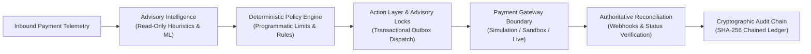
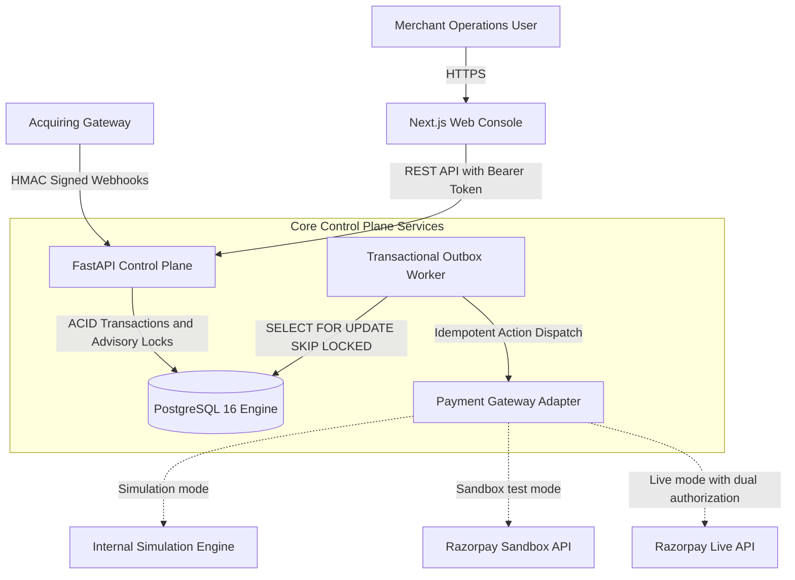

# RAY

## Merchant Revenue Recovery Control Plane

Deterministic execution engine, transactional outbox, and financial invariant enforcement for payment retry and remediation workflows.

[](https://github.com/AYUSH676-JARVIS/RAY/actions/workflows/ci.yml)
[](tests/)
[](tests/invariants/)
[](tests/concurrency/)
[](apps/web/e2e/)
[](docs/security.md)
[](requirements.txt)
[](apps/web/)
[](#license)



---

## Why RAY exists

In card-not-present e-commerce and merchant billing, payment transactions frequently fail due to transient infrastructure conditions (bank network timeouts, 3DS authentication drops, acquirer throttling) rather than permanent account closures.

However, automated recovery without strict financial controls introduces severe failure modes:
1. **The Read Timeout Ambiguity Trap**: When an HTTP POST to an acquirer times out after 10 seconds, the client cannot distinguish between a dropped request, a processing delay, or an already-settled debit. Blindly retrying creates duplicate debits for the cardholder.
2. **Card Network Penalties**: Indiscriminate retries on permanent declines violate card network rules (e.g. Visa Category 1 fraud retry prohibitions) and increase merchant dispute ratios.
3. **Split-Brain Concurrency**: Disjoint distributed locks (e.g., Redis TTL-based locks) can expire prematurely under worker garbage collection pauses, allowing concurrent workers to double-debit transactions.
4. **Unconstrained Direct AI Authority**: Allowing language models or heuristic agents direct write access or API credentials creates prompt injection vulnerabilities and unbounded financial liability.

RAY solves this by providing a deterministic control plane that decouples recovery recommendation from execution authority, serializes concurrent attempts with PostgreSQL advisory locks, atomically commits outbox events, and preserves ambiguous states until authoritative reconciliation.

---

## Core design principle

> **Recommendation is not authorization.**  
> Recovery recommendations must never directly execute financial actions.

* **Advisory Models** evaluate payment telemetry, failure codes, and customer risk profiles to suggest recovery strategies. They operate in a strictly read-only sandbox with **zero database mutation rights** and **zero payment gateway credentials**.
* **Deterministic Policy Engine** evaluates programmatic business rules (retry ceilings, velocity caps, fraud blocks, tenant boundaries). If policy checks fail, execution is rejected before touching the network.
* **Deterministic Action Layer** coordinates execution via PostgreSQL transaction-scoped advisory locks, ensuring exact-once dispatch semantics.
* **Authoritative Outcome Verification** confirms monetary reality via cryptographic webhook processing and status inquiry reconciliation.
* **Cryptographic Audit Logger** records every state transition in an immutable, SHA-256 parent-hash chained log.

---

## Architecture



### Component Boundaries
* **Merchant Web Console (`apps/web/`)**: Next.js 16 (React 19, TypeScript) console for real-time telemetry, decision inspection, manual action review, audit chain verification, and administrative controls.
* **Control Plane API (`apps/api/`)**: FastAPI REST API providing multi-tenant isolation, role-based access control (RBAC), idempotency evaluation, opportunity detection, and cryptographic webhook ingestion.
* **Relational Storage & State Engine (`services/money_graph/`)**: PostgreSQL 16 maintaining relational entities across 12 domain models with transaction-scoped advisory locks and the transactional outbox table.
* **Background Worker Daemon (`apps/worker/`)**: Polling-based daemon executing outbox dispatch, scheduled retry triggers, and ambiguous payment reconciliations.
* **Gateway Adapter Boundary (`services/action_layer/gateway.py`)**: Gateway abstraction normalizing external acquirer interactions into uniform `GatewayResult` objects across simulation, sandbox, and live execution modes.

---

## Safety model

RAY enforces non-negotiable financial and architectural safety controls across all operations:

1. **Stage 1 Safety Lock**: `STAGE_1_SAFETY_LOCK=true` is the default setting. Live autonomous money movement is halted even if production gateway credentials are present, recording `BLOCKED_STAGE1_SAFETY`.
2. **Distributed Idempotency**: In PostgreSQL, `IdempotencyManager` computes a deterministic 32-bit positive integer hash of `(merchant_id, idempotency_key)` and executes `SELECT pg_try_advisory_xact_lock(:key)`. Concurrent duplicate calls fail fast with `ConcurrentExecutionBlockedError` (HTTP 409 Conflict). Completed actions return cached receipts from durable database storage even across process reboots.
3. **Transaction Boundaries**: Domain mutations and outbound `OutboxEvent` records are committed in the exact same ACID database transaction, preventing dual-write inconsistencies.
4. **Transaction-Scoped Advisory Locking**: Advisory locks are bound to the transaction scope (`pg_try_advisory_xact_lock`), automatically releasing when the transaction commits or rolls back, eliminating leaked locks.
5. **`UNKNOWN ≠ FAILED`**: Gateway network timeouts and ambiguous responses transition transactions to `PaymentStatus.UNKNOWN`. Direct retries are blocked with `AmbiguousOutcomeBlockedError` until authoritative reconciliation confirms status.
6. **Authoritative Reconciliation**: `ReconciliationWorker` resolves ambiguous states via webhook verification or explicit gateway status inquiries before permitting subsequent recovery steps.
7. **Emergency Kill Switch**: PostgreSQL-backed kill switch (`system_settings.kill_switch_engaged`) immediately halts all recovery execution across all workers. The engine fails closed if database connectivity is interrupted.
8. **Cryptographic Audit Trail**: Continuous SHA-256 parent-hash chain linking all `AuditEvent` records: `event_hash = SHA256(prev_hash : merchant_id : sequence_number : event_type : actor_id : canonical_payload)`. Any database alteration breaks sequence verification.
9. **Zero Float Arithmetic**: All amounts are represented as `NUMERIC(18, 4)` and handled strictly as Python `decimal.Decimal` with `ROUND_HALF_UP` quantization.

---

## What is implemented

The table below summarizes the verified capabilities implemented in this repository:

| Component | Implementation | Source Path | Status |
| :--- | :--- | :--- | :--- |
| **Control Plane API** | FastAPI, Pydantic v2, CORS, rate limiting, security headers | [`apps/api/main.py`](apps/api/main.py) | Verified |
| **Relational Data Model** | 12 SQLAlchemy models, foreign keys, Alembic migrations | [`services/money_graph/models.py`](services/money_graph/models.py) | Verified |
| **Advisory Locking** | PostgreSQL transaction-scoped advisory locks | [`services/action_layer/idempotency.py`](services/action_layer/idempotency.py) | Verified |
| **Transactional Outbox** | Outbox event persistence and worker polling with `SKIP LOCKED` | [`services/worker/outbox_processor.py`](services/worker/outbox_processor.py) | Verified |
| **Ambiguity Handling** | `UNKNOWN ≠ FAILED` enforcement and reconciliation blocking | [`services/action_layer/executor.py`](services/action_layer/executor.py) | Verified |
| **Deterministic Policy** | Programmatic retry limits, velocity caps, fraud rules | [`services/policy_engine/engine.py`](services/policy_engine/engine.py) | Verified |
| **Advisory AI Isolation** | Read-only recommendation scoring, zero execution credentials | [`services/opportunities/ai_reasoning.py`](services/opportunities/ai_reasoning.py) | Verified |
| **Input Sanitization** | Regex prompt injection neutralization and PII masking | [`services/opportunities/ai_reasoning.py`](services/opportunities/ai_reasoning.py) | Verified |
| **Webhook Security** | Constant-time HMAC-SHA256 verification and 300s replay window | [`services/webhook/security.py`](services/webhook/security.py) | Verified |
| **Gateway Adapters** | Simulation engine, Razorpay test/live adapter boundary | [`services/action_layer/gateway.py`](services/action_layer/gateway.py) | Verified |
| **Cryptographic Audit** | Continuous SHA-256 parent-hash chain and verification endpoint | [`services/audit/logger.py`](services/audit/logger.py) | Verified |
| **Web Console** | Next.js 16, React 19, TypeScript, Tailwind CSS v4, standalone build | [`apps/web/`](apps/web/) | Verified |

---

## Verification

Every component and invariant is verified through automated test suites in the repository:

| Verification Gate | Result | Test Suite & Evidence |
| :--- | :---: | :--- |
| **Backend test suite** | **334 / 334 PASS** | Full Pytest suite covering all services, models, and endpoints |
| **Financial invariants** | **54 / 54 PASS** | [`tests/invariants/`](tests/invariants/): Zero-float, UNKNOWN != FAILED, state machine |
| **Security & trust tests** | **61 / 61 PASS** | [`tests/security/`](tests/security/): Prompt injection, PII masking, HMAC verification, RBAC |
| **Concurrency & race tests** | **15 / 15 PASS** | [`tests/concurrency/`](tests/concurrency/): 100-thread race, advisory locks, outbox |
| **Failure & resilience tests** | **16 / 16 PASS** | [`tests/failure/`](tests/failure/): Socket timeouts, 500 errors, process crashes |
| **Integration & gateway tests** | **45 / 45 PASS** | [`tests/integration/`](tests/integration/): Gateway mode resolution, webhooks, admin APIs |
| **End-to-end workflows** | **25 / 25 PASS** | [`tests/e2e/`](tests/e2e/): Multi-step recovery pipelines and lifecycles |
| **Unit domain tests** | **118 / 118 PASS** | [`tests/unit/`](tests/unit/): Opportunity engine, money graph, models, settings |
| **Browser E2E journeys** | **10 / 10 PASS** | [`apps/web/e2e/`](apps/web/e2e/): Playwright browser journeys on Chromium |
| **Dependency vulnerability audit** | **0 CVEs** | `pip-audit` (Python) and `npm audit` (Node) |
| **Repository secrets scanning** | **0 Leaks** | Gitleaks 8.24 scan across workspace and git commit history |
| **Database migration drift** | **0 Drift** | `alembic check` clean against PostgreSQL 16 schema |
| **Frontend static analysis** | **0 Errors / 0 Warnings** | ESLint and Next.js 16 production build verification |

---

## Quick start

### Local Docker Stack (Recommended)

```bash
# 1. Clone repository
git clone https://github.com/AYUSH676-JARVIS/RAY.git
cd RAY

# 2. Build and launch all services
docker compose up --build
```

### Verified Service URLs

* **Merchant Web Console**: `http://localhost:3000`
* **FastAPI Swagger UI**: `http://localhost:8000/docs`
* **Prometheus Metrics**: `http://localhost:8000/metrics`
* **Health Check**: `http://localhost:8000/health`
* **Readiness Check**: `http://localhost:8000/ready`

### Native Setup (Alternative)

```bash
# Python backend
python3 -m venv .venv
source .venv/bin/activate
pip install -r requirements.txt
cp .env.example .env
alembic upgrade head
python scripts/generate_data.py --customers 20 --orders 50 --payments 50 --failed 10
uvicorn apps.api.main:app --host 127.0.0.1 --port 8000 &
python apps/worker/main.py --interval 3 &

# Next.js frontend
npm run dev --prefix apps/web
# Access: http://127.0.0.1:3000
```

---

## Production notes

* **Live Execution Disabled by Default**: Live execution against external card networks is locked. Enabling requires `LIVE_EXECUTION_ENABLED` (`true`), `STAGE_1_SAFETY_LOCK` (`false`), valid production credentials, and Stage 2 administrative approval.
* **Simulation & Sandbox Modes**: `SIMULATION` uses an internal deterministic mock engine with zero network calls. `SANDBOX` connects to Razorpay test endpoints using test credentials (`rzp_test_...`).
* **Production Secret Requirements**: In production (`ENVIRONMENT=production`), the application refuses to start if `POSTGRES_PASSWORD`, `JWT_SECRET_KEY` (min 32 chars), or `RAZORPAY_WEBHOOK_SECRET` are missing or default. Wildcard CORS with credentials is strictly prohibited.
* **Fail-Closed Architecture**: Missing database migrations abort worker startup without attempting runtime DDL alterations.

---

## Known Limitations & Tradeoffs

1. **Single-Primary PostgreSQL Scaling**: Advisory locks and the transactional outbox rely on PostgreSQL ACID guarantees on a single primary node. Scaling beyond single-primary write limits requires sharding by merchant ID or a partitioned event log (Kafka/Kinesis).
2. **Worker Polling Interval**: The background outbox worker polls on a 3-second loop. Sub-second SLAs would require PostgreSQL `LISTEN/NOTIFY` or an event-driven queue consumer.
3. **Gateway Lifecycle Scope**: The implemented adapter focuses on the Razorpay lifecycle (`Order -> Payment -> Refund`). Supporting two-phase authorization and capture (Stripe/Adyen) requires mapping their distinct capture states.
4. **Merchant-Level Velocity**: Retry limits (`max_retries=3`) and cooldowns are tracked per merchant. Global card-network BIN velocity tracking across multiple merchants requires a shared tokenization vault.
5. **Clock Ordering in Distributed Audit Logs**: Audit hash chaining uses database sequence numbers. Multi-region active-active topologies would require Hybrid Logical Clocks to prevent parent-hash ordering conflicts during concurrent writes.

---

## Repository structure

```
RAY/
├── .github/workflows/ci.yml   # CI pipeline: 5 mandatory verification jobs
├── apps/
│   ├── api/                   # FastAPI Control Plane service
│   ├── web/                   # Next.js 16 Web Console (React 19, TypeScript)
│   │   └── e2e/               # Playwright browser E2E test suite
│   └── worker/                # Background worker daemon (outbox, recon, retry)
├── deploy/
│   ├── Dockerfile.api         # Production multi-stage container for API
│   ├── Dockerfile.web         # Production multi-stage container for Web
│   ├── Dockerfile.worker      # Production multi-stage container for Worker
│   └── nginx/                 # Reverse proxy configuration
├── docs/                      # Architecture, security, and threat model specifications
├── migrations/versions/       # Alembic migrations (0001 -> 0003)
├── ml/                        # ML scoring models and evaluation pipelines
├── scripts/                   # Data generation, packaging, and verification tools
├── services/                  # Domain services (action layer, audit, auth, money graph)
├── tests/                     # 334 tests (invariants, security, concurrency, failure)
├── docker-compose.yml         # Developer multi-container compose stack
├── docker-compose.prod.yml    # Production container orchestration stack
└── requirements.txt           # Python dependency manifest
```

---

## Documentation Sitemap

* **[Architecture Reference](docs/architecture.md)**: Request flows, database schema, and entity relationships.
* **[Interview & Architecture Defense Guide](docs/INTERVIEW_GUIDE.md)**: Architectural decisions, concurrency mechanics, and technical trade-offs.
* **[STRIDE Threat Model](docs/THREAT_MODEL.md)**: Threat evaluations across primary financial attack surfaces.
* **[Security Architecture](docs/security.md)**: Cryptographic audit chaining, RBAC, and secret management.
* **[Interactive Demo Runbook](docs/DEMO.md)**: Deterministic evaluation scripts and test scenarios.
* **[Developer Guide](docs/DEVELOPMENT.md)**: Local setup conventions, testing commands, and contribution standards.
* **[Production Deployment](docs/DEPLOYMENT.md)**: Multi-stage container builds, non-root users, and secret injection.
* **[Disaster Recovery](docs/DISASTER_RECOVERY.md)**: Recovery procedures, emergency kill switch activation, and ledger reconciliation.

---

## License

This project is licensed under the [MIT License](https://opensource.org/licenses/MIT).
