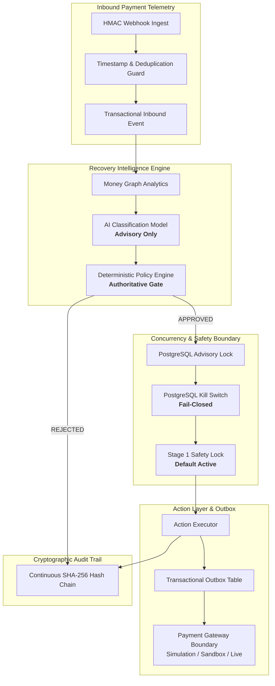

# RAY Merchant Revenue Recovery Control Plane — Technical Interview & Engineering Defense Guide

> **Target Audience:** Engineering interviewers, CTOs, and Staff/Principal Engineers evaluating fintech architecture, distributed systems, concurrency guarantees, and financial safety at Stripe, Razorpay, Adyen, or FAANG caliber.

---

## 1. Executive Pitches

### 30-Second Pitch (Elevator Summary)
> "RAY is a multi-tenant Merchant Revenue Recovery Control Plane built in Python, FastAPI, PostgreSQL, and Next.js that autonomously recovers failed e-commerce transactions without exposing merchants to duplicate debits or financial risk. Unlike naive retry systems or opaque AI wrappers, RAY enforces a strict 5-layer execution boundary where machine intelligence only recommends strategies, deterministic policy engines authorize execution, PostgreSQL advisory locks guarantee distributed idempotency, and every state transition is anchored in an immutable SHA-256 cryptographic audit chain."

### 2-Minute Pitch (System Narrative)
> "In high-volume payment processing, approximately 15% to 22% of transactions decline due to transient network drops, soft bank timeouts, and friction during 3DS authentication. Naive automated retries create catastrophic card-network scheme penalties and duplicate debit liabilities.
>
> RAY solves this through an institutional-grade control plane:
> 1. **Money Graph Model**: Declines are ingested as structured graph entities linking payments, customer velocity, card issuers, and decline taxonomies.
> 2. **Deterministic-First Authority**: AI models propose optimal recovery strategies (e.g., smart retry windows, routing cascades), but **AI has zero execution authority**. All execution rights belong strictly to deterministic, tenant-isolated merchant policy engines that enforce rigid velocity limits, retry caps, and fraud rules.
> 3. **Concurrency & Idempotency**: Distributed execution uses PostgreSQL advisory transaction locks (`pg_try_advisory_xact_lock`) combined with a Transactional Outbox pattern. Concurrent race attempts result in structured HTTP 409 Conflicts, guaranteeing exactly-once gateway execution.
> 4. **Authoritative Reconciliation**: Gateway socket timeouts are classified as `UNKNOWN` rather than `FAILED`. Automated retries are strictly prohibited until gateway settlement reality is verified via authoritative polling or signed HMAC webhooks.
> 5. **Fail-Closed Safety**: A dual-key administrative lock enforces Stage 1 safety by default, while a cluster-wide emergency kill switch stored in PostgreSQL immediately halts autonomous execution across all API nodes and background workers."

---

## 2. 5-Minute Deep Dive Architecture Walkthrough

### Stage-by-Stage Breakdown:
1. **Webhook Ingestion**: Gateway webhooks undergo constant-time HMAC-SHA256 signature verification, a 300-second timestamp drift check (replay protection), and database-level event deduplication.
2. **State Graph Construction**: Events hydrate the merchant's Money Graph, linking payment attempts, decline codes, and customer risk profiles.
3. **AI Strategy Formulation**: Machine learning models evaluate historical recovery yield and propose a remediating strategy (e.g., `SMART_RETRY_WINDOW`, `ROUTING_CASCADE`).
4. **Deterministic Policy Gate**: The policy engine verifies merchant-configured velocity caps, max retry limits, and fraud zero-tolerance rules. If policy fails, the action is marked `BLOCKED_POLICY` and aborted.
5. **PostgreSQL Advisory Locking**: To prevent split-brain worker races, an advisory lock is hashed from `(merchant_id, idempotency_key)` and acquired inside a transaction.
6. **Execution & Transactional Outbox**: The action and its outbound event are committed atomically to PostgreSQL. The background worker drains the outbox and dispatches to the gateway adapter.
7. **Cryptographic Chaining**: Every state modification generates an event record where `event_hash = SHA256(previous_hash + payload + sequence + timestamp)`.

---

## 3. Engineering Decisions & Technical Defense

### Why PostgreSQL Advisory Locks over Redis / Redlock?
* **Transaction Fate Binding**: Redis locks (`Redlock`) exist in a separate consensus domain from the database. If a worker acquires a Redis lock, executes a payment, and dies before writing to Postgres (or Postgres transaction rolls back), the lock state desynchronizes from database reality.
* **Zero Orphan Locks**: `pg_try_advisory_xact_lock` is natively scoped to the PostgreSQL transaction. If the connection drops, worker crashes, or transaction aborts, PostgreSQL **automatically and immediately releases the lock**.
* **Zero Distributed Consensus Overhead**: No separate Redis cluster to monitor, patch, or secure in PCI-DSS network scopes.

### Why Transactional Outbox instead of direct message broker calls?
* **Dual-Write Problem Prevention**: Directly writing to Postgres and publishing to Kafka/RabbitMQ in the same HTTP handler creates an unavoidable failure window. If the message broker rejects the message after DB commit, or vice-versa, state is corrupt.
* **Atomic Commit Guarantee**: The outbound event is written to the `outbox_events` table in the *exact same ACID transaction* as the financial record. The worker polls with `SELECT ... FOR UPDATE SKIP LOCKED`, guaranteeing at-least-once delivery with zero orphaned side-effects.

### Why UNKNOWN ≠ FAILED? (The Golden Invariant)
* **The Danger**: When an HTTP request to Razorpay/Stripe times out after 10 seconds, the client application has **no idea** whether the acquirer processed the charge, timed out at the card network, or debited the user.
* **The Failure Mode**: Naive systems classify timeouts as `FAILED` and immediately issue another payment attempt. This results in the merchant charging the customer twice, incurring dispute fees, chargebacks, and scheme penalties.
* **RAY's Defense**: Any network timeout or gateway 5xx error transitions the payment to `UNKNOWN`. In `UNKNOWN` state:
  1. Downstream retry policies are strictly locked.
  2. Autonomous money movement is blocked.
  3. The payment enters the Authoritative Reconciliation Queue until settlement telemetry is validated via polling `query_status()` or inbound webhook.

### Why Deterministic Policy Before AI?
* **Zero Hallucination Tolerance**: LLMs and stochastic models cannot be trusted with direct monetary debit authorization. Prompt injections, model drift, and non-deterministic temperature sampling could cause catastrophic over-billing.
* **Clear Legal Responsibility**: In fintech, every debit must have an explainable, auditable reason code. RAY treats AI strictly as an **Advisory Optimizer**. The deterministic engine evaluates rigid boolean rules, velocity budgets, and merchant configurations before execution is legally cleared.

### Why PostgreSQL-Authoritative Kill Switch?
* In-memory flags or Redis keys can be cleared by restarts, network partitions, or pod evictions.
* RAY's Kill Switch state resides in the `merchants` table in PostgreSQL.
* Every execution path checks the persistent kill switch flag inside the transaction. If database connectivity is lost, the executor **fails closed**, immediately halting execution.

---

## 4. Concurrency, Race Conditions & Failure Scenarios

| Failure Scenario | Real-World Trigger | RAY Architectural Defense |
| :--- | :--- | :--- |
| **Concurrent Duplicate API Requests** | Double-clicking payment button; network retries | PostgreSQL advisory locks detect in-flight lock; returns structured **HTTP 409 Conflict** with `ConcurrentExecutionBlockedError`. |
| **Gateway Timeout (Socket Drop)** | Acquiring bank takes 12s to respond to 3DS | Transitions state to `UNKNOWN`. Blind retry is forbidden. Awaiting authoritative reconciliation. |
| **Out-of-Order Webhooks** | `payment.failed` arrives before `payment.created` | Webhook handler verifies entity existence and validates state machine transition matrix; out-of-order mutations are rejected. |
| **Replay Attack on Webhooks** | Adversary replaying valid captured webhook payload | Webhook signature checked with HMAC-SHA256; timestamp checked against 300s window; event UUID checked in DB with unique constraint. |
| **Worker Process Crash Mid-Execution** | OOM killer terminates worker container | PostgreSQL advisory lock releases automatically upon connection drop; uncommitted outbox event remains in queue for next worker sweep. |
| **Audit Log Tampering** | Malicious DB admin alters payment amount | Cryptographic verification traverses SHA-256 parent hashes. Any altered byte breaks downstream signatures, flagged as `TAMPER ALERT`. |

---

## 5. Scalability & Production Evolution (10x to 100x Scale)

### What would be changed at 10x Scale (1,000 req/sec)?
1. **Outbox Partitioning**: Transition from PostgreSQL polling to Debezium Change Data Capture (CDC) streaming outbox events directly from WAL logs to Apache Kafka.
2. **Read Replica Splitting**: Route analytical Money Graph queries, dashboard aggregations, and telemetry reads to streaming Postgres read-replicas.
3. **Advisory Lock Hashing**: Implement explicit 64-bit CRC32 namespace partitioning for advisory locks to prevent theoretical lock key space collisions.

### What remains intentionally simulated in this repository?
* **Live Card Schemes**: Real card payments require live Razorpay merchant credentials (`rzp_live_...`). By design, `LIVE_EXECUTION_ENABLED=false` is enforced in source code and configuration to prevent accidental money movement. A comprehensive `SimulationGateway` and deterministic `SandboxGateway` emulate real gateway behavior.
* **AI Model Weights**: Machine learning recommendations use structured Bayesian scoring heuristics rather than a multi-gigabyte external neural network container, ensuring the repository runs deterministically in standard CI/CD and Docker environments.

---

## 6. Interviewer Technical Q&A Cheat Sheet

**Q: "How does tenant isolation work if all data is in one PostgreSQL database?"**
> *"RAY implements logical multi-tenancy enforced at both the API and database layers. Every API request requires a Bearer token that resolves to a specific `merchant_id`. In the service layer, all database queries explicitly filter by `merchant_id`. Secondary tables (actions, failures, opportunities, audit events) include foreign keys to `merchants.id`. In production, this can be combined with PostgreSQL Row-Level Security (RLS) for defense-in-depth."*

**Q: "What happens if two workers try to process the exact same opportunity simultaneously?"**
> *"The worker attempts to acquire an advisory transaction lock on `hash(merchant_id, idempotency_key)`. The second worker fails to acquire the non-blocking lock (`pg_try_advisory_xact_lock` returns `false`), immediately rolls back, logs an idempotency collision metric, and aborts without touching the payment gateway."*

**Q: "Can an attacker modify the audit logs in the database directly?"**
> *"An attacker with database access could modify rows, but they cannot forge the cryptographic audit chain without rewriting the entire history. Because each event hash incorporates the previous event's SHA-256 hash, any mutation invalidates all subsequent hashes. Calling `GET /api/v1/audit/verify` immediately identifies the exact record where the chain was broken."*
