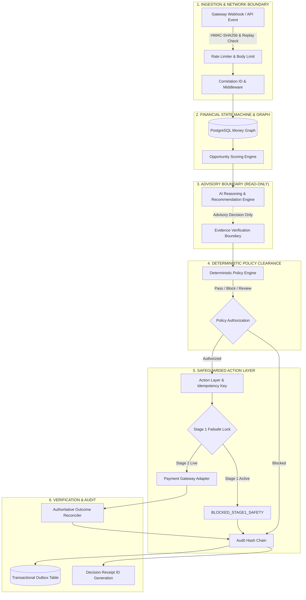
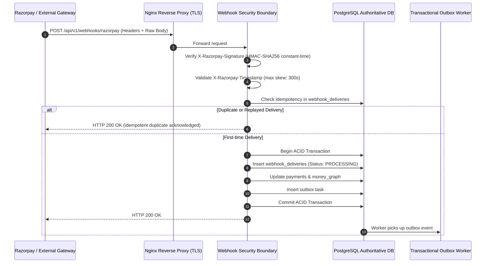
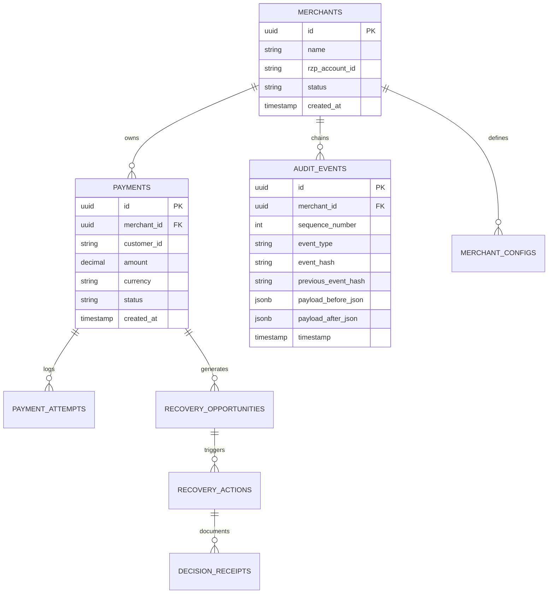

# RAY Merchant Revenue Recovery Control Plane — Master Production Architecture

**Document Version**: 2.0.0-PROD  
**Classification**: Engineering Architecture & Governance Blueprint  
**System Invariant**:  
> **"AI RECOMMENDS. DETERMINISTIC POLICY AUTHORIZES. DETERMINISTIC ACTION LAYER EXECUTES. OUTCOME VERIFICATION CONFIRMS REALITY. AUDIT RECORDS EVERYTHING."**

---

## 1. System Overview & Core Invariants

RAY is an enterprise-grade autonomous control plane designed to recover failed electronic merchant payments. Unlike legacy payment retry engines or generative AI workflows, RAY strictly segregates advisory intelligence from deterministic financial execution.

---

## 2. End-to-End Decision Flow (Canonical 9 Stages)

Every recovery event traverses 9 canonical lifecycle stages. No stage may be bypassed, reordered, or short-circuited:

| Stage Number | Stage Identifier | Core Responsibility | Failure / Safety Behavior |
| :---: | :--- | :--- | :--- |
| **Stage 1** | `EVENT` | Ingests normalized payment failure metadata, validates idempotency keys. | Drops corrupt payloads, rejects replayed events. |
| **Stage 2** | `MONEY_GRAPH` | Hydrates historical customer attempts, risk profiles, and failure codes from PostgreSQL. | Fails closed on database timeout or connection pool exhaustion. |
| **Stage 3** | `OPPORTUNITY` | Computes expected recovery probability, net recoverable value, and urgency. | If expected recovery $\le 0$, workflow cleanly halts with zero action. |
| **Stage 4** | `DECISION` | AI/ML generates advisory remediation strategy (e.g. `SMART_ROUTING`, `OPTIMAL_RETRY_WINDOW`). | Advisory only. Model has zero credentials and cannot mutate financial state. |
| **Stage 5** | `POLICY` | Deterministic rule engine checks velocity limits, risk thresholds, and merchant policy constraints. | Blocks execution if rule triggers (e.g., `VELOCITY_LIMIT_EXCEEDED_RULE`). |
| **Stage 6** | `ACTION` | Resolves idempotency key and dispatches to payment gateway. | Failsafe: If Stage 1 is active, halts with `BLOCKED_STAGE1_SAFETY`. |
| **Stage 7** | `VERIFICATION` | Queries authoritative gateway settlement status to confirm fund arrival. | If status is ambiguous, sets `UNKNOWN` and schedules background reconciliation. |
| **Stage 8** | `AUDIT` | Computes SHA-256 HMAC hash chained to previous event sequence number. | Cryptographically immutable. Hash mismatch triggers critical platform alert. |
| **Stage 9** | `DECISION_RECEIPT`| Emits immutable UUIDv5/UUIDv4 audit receipt linking all evidence and hashes. | Stored in PostgreSQL and surfaced on dashboard. |

---

## 3. Webhook Architecture & Timing Attack Immunity

---

## 4. Multi-Tenant Database Architecture & Schema Isolation

All relational data is stored in PostgreSQL and tracked via Alembic migrations.

---

## 5. Worker Architecture & Horizontal Scalability

RAY deploys as stateless API nodes coordinated by PostgreSQL distributed locks:

1. **Advisory Locking**: Critical action execution keys are protected by `pg_try_advisory_lock` to serialize concurrent webhook retries.
2. **Outbox Pattern**: API write paths record state changes and outbox messages within the same PostgreSQL transaction.
3. **Task Queue Worker**: Horizontally scalable background workers (`apps.worker.main`) pull pending tasks via `FOR UPDATE SKIP LOCKED` semantics, ensuring zero duplicate dispatches across multiple nodes.

---

## 6. Financial Safety & Two-Stage Execution

- **Stage 1 (Default)**: Failsafe active (`BLOCKED_STAGE1_SAFETY`). Live credentials cannot be reached. Simulated outcomes allow end-to-end verification without moving real capital.
- **Stage 2 (Production Live)**: Requires multi-party administrative cryptographic activation (`POST /api/v1/admin/stage2/activate`). Instant fail-closed kill switch (`POST /api/v1/admin/kill-switch`) immediately forces the platform back to Stage 1.
