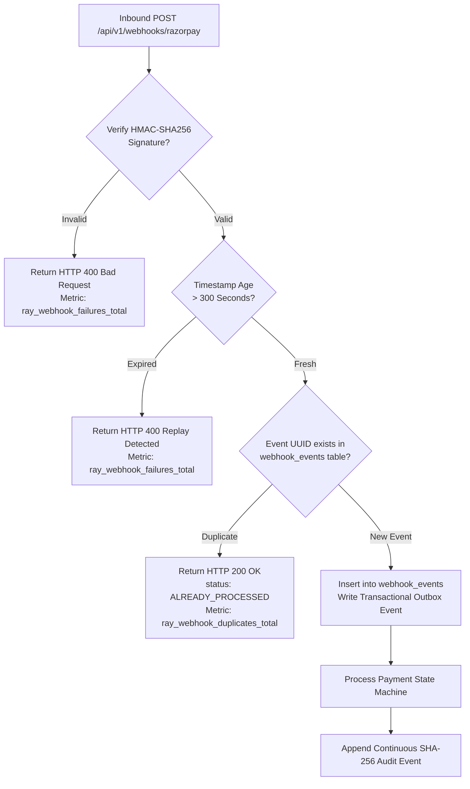
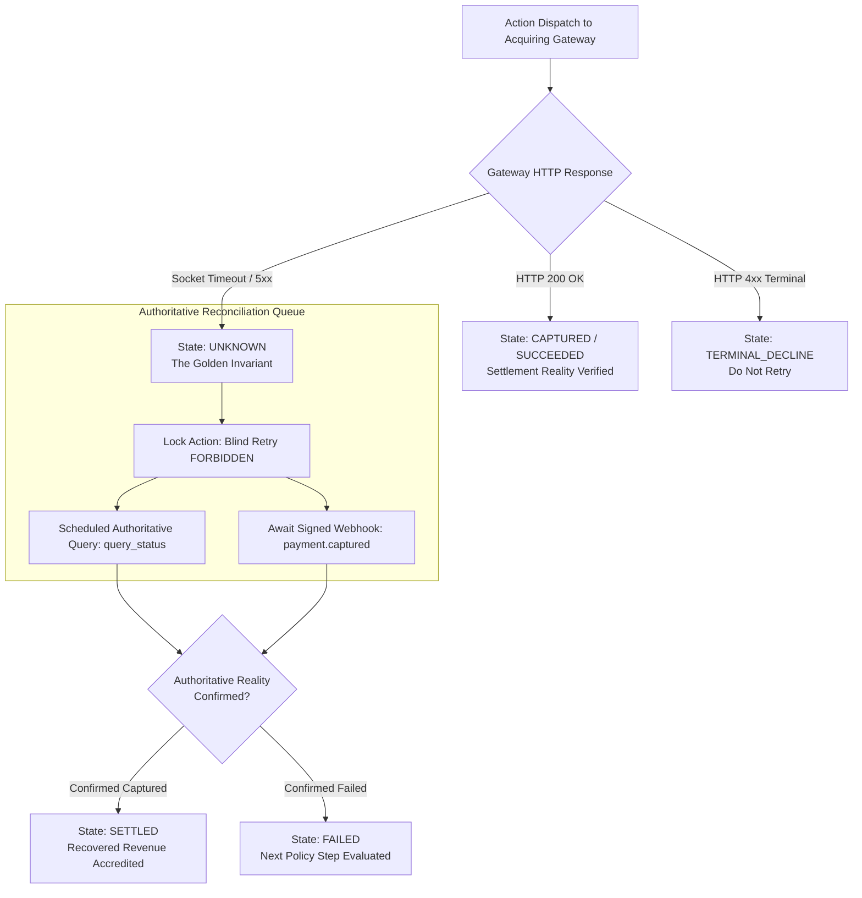
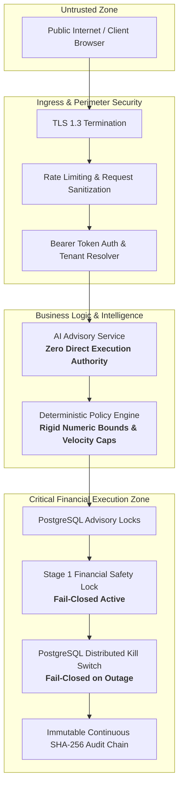
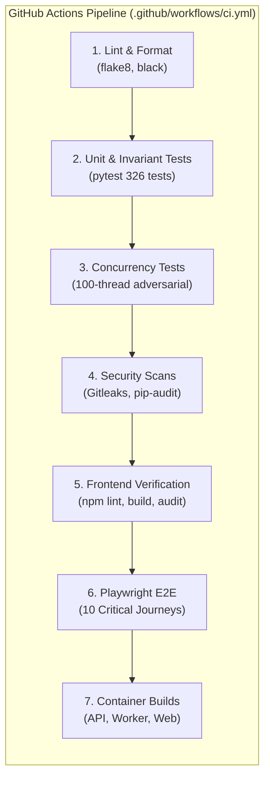
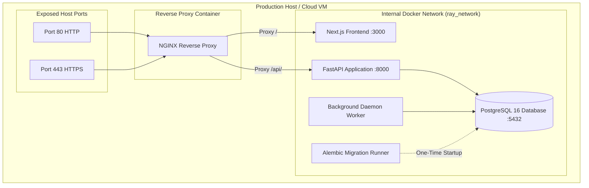

# RAY Merchant Revenue Recovery Control Plane — Technical Architecture & Engineering Specifications

> **System Overview:** Institutional-grade revenue recovery and transaction intelligence platform designed for high-volume merchant acquiring environments.

---

## 1. High-Level System Architecture

```mermaid
graph TD
    Client([Merchant Web Console / Browser]) <-->|HTTPS / TLS 1.3| NGINX[NGINX Reverse Proxy :80/:443]
    ExternalGW([Acquiring Gateways / Razorpay]) <-->|HMAC Webhooks & REST| NGINX

    subgraph DOCKER_COMPOSE["Ray Isolated Network (ray_network)"]
        NGINX -->|Route / | WebApp[Next.js 16 Web Console :3000]
        NGINX -->|Route /api/ | API[FastAPI Control Plane Node :8000]

        subgraph BACKEND_SERVICES["Backend Domain Layer"]
            API -->|ACID Transactions| DB[(PostgreSQL 16 Engine :5432)]
            Worker[Outbox Worker Daemon] -->|Poll Outbox SKIP LOCKED| DB
            Worker -->|Idempotent Gateway Dispatch| GatewayAdapter[Gateway Adapter Boundary]
        end
    end

    GatewayAdapter -.->|Mode: SIMULATION| SimEngine[Internal Simulation Engine]
    GatewayAdapter -.->|Mode: SANDBOX| RzpSandbox[Razorpay Sandbox API]
    GatewayAdapter -.->|Mode: LIVE (Strict Opt-In)| RzpLive[Razorpay Live API]
```

---

## 2. Financial Execution Sequence & 5-Layer Boundary

```mermaid
sequenceDiagram
    autonumber
    actor Merchant as Merchant System / Declining Event
    participant API as FastAPI Ingestion
    participant MG as Money Graph & Analytics
    participant AI as AI Advisory Model
    participant Policy as Deterministic Policy Engine
    participant Lock as PostgreSQL Advisory Lock
    participant DB as PostgreSQL (ACID Outbox)
    participant Worker as Background Worker
    participant GW as Gateway Boundary

    Merchant->>API: Submit Failed Payment / Ingest Decline Event
    API->>MG: Hydrate Payment Entity & Decline Taxonomy
    MG->>AI: Propose Remediating Strategy (e.g. SMART_RETRY)
    Note over AI: AI has ZERO execution authority.<br/>Advisory proposal only.
    AI-->>Policy: Propose (strategy_name, risk_score, win_rate)
    
    rect rgb(20, 30, 40)
        Note over Policy: Deterministic Safety Evaluation
        Policy->>Policy: Validate Merchant Velocity Limits
        Policy->>Policy: Validate Maximum Retry Attempts (<= 3)
        Policy->>Policy: Validate Fraud Tolerance (Zero-Tolerance)
    end

    alt Policy REJECTS
        Policy-->>API: BLOCKED_POLICY (Exit without Execution)
        API->>DB: Record Chained Audit Event
    else Policy APPROVES
        Policy->>Lock: Acquire pg_try_advisory_xact_lock(merchant_id, idempotency_key)
        alt Lock Failed (Concurrent Race)
            Lock-->>API: HTTP 409 Conflict (ConcurrentExecutionBlockedError)
        else Lock Acquired
            Policy->>DB: Atomic Write: Action Record + Transactional Outbox Event
            DB-->>API: Commit Transaction (Advisory Lock Released)
            API-->>Merchant: Action Queued (Structured HTTP 200/202)
        end
    end

    Worker->>DB: SELECT * FROM outbox_events FOR UPDATE SKIP LOCKED
    Worker->>GW: Execute Gateway Call with Idempotency Key
    GW-->>Worker: Outcome: SUCCEEDED | UNKNOWN | FAILED
    Worker->>DB: Update State Machine & Record SHA-256 Chained Audit
```



---

## 3. Webhook Ingestion & Replay Protection Flow



---

## 4. Concurrency & Idempotency Flow

```mermaid
flowchart TD
    ReqA[Request A: Idempotency Key X] --> LockA{pg_try_advisory_xact_lock<br/>Hash(merchant_id, X)}
    ReqB[Request B: Idempotency Key X<br/>Concurrent In-Flight] --> LockB{pg_try_advisory_xact_lock<br/>Hash(merchant_id, X)}

    LockA -- Lock Acquired --> ExecA[Execute Business Logic & Outbox Write]
    ExecA --> CommitA[DB Transaction Commit<br/>Lock Automatically Released]

    LockB -- Lock Busy --> BlockB[Raise ConcurrentExecutionBlockedError]
    BlockB --> Resp409[Return Structured HTTP 409 Conflict<br/>Metric: ray_idempotency_collisions_total]

    ReqC[Request C: Idempotency Key X<br/>Subsequent Replay] --> IdemQuery{idempotency_key<br/>already in actions table?}
    IdemQuery -- Found --> ReplayCached[Return Cached Execution Result<br/>idempotent_replay: true]
```

---

## 5. Authoritative Reconciliation Flow (UNKNOWN ≠ FAILED)



---

## 6. Security Boundary & Authority Separation



---

## 7. CI/CD Automated Verification Pipeline



---

## 8. Production Deployment Architecture (Docker Compose)


